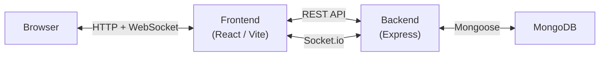

ChatsPeCharcha is a full-stack real-time chat application split into two independent layers: a React single-page application on the frontend and an Express-based REST and WebSocket API on the backend. The frontend communicates with the backend over HTTP for data fetching and mutations, while Socket.io maintains a persistent WebSocket connection for low-latency features like instant messaging, typing indicators, and online presence.

## High-level diagram

The diagram below shows how data flows between the browser, the React app, the Express server, and MongoDB, with Socket.io running in parallel for real-time events.

## Application layers

**Frontend SPA** — The React application is built with Vite and TypeScript. It handles routing, local state via Redux Toolkit, server-state caching via React Query, and the Socket.io client connection. All pages are rendered client-side; in production the Express server also serves the compiled static bundle.

**Backend REST + WebSocket API** — The Express server exposes three route groups under `/api`. It persists data to MongoDB through Mongoose models, issues and validates JWT tokens for authentication, and runs the Socket.io server on the same HTTP server instance. The shared `app` and `server` objects are created in `lib/socket.js` and imported by `index.js`.

## Technology stacks

<CardGroup cols={2}>
  <Card title="Frontend" icon="browser">
    - React 18 with TypeScript
    - Vite (dev server and bundler)
    - Tailwind CSS (utility-first styling)
    - Shadcn UI (accessible component library)
    - Redux Toolkit (global state)
    - React Query (server-state caching)
    - Socket.io client (real-time events)
    - next-themes (dark / light mode)
    - date-fns (date formatting)
  </Card>
  <Card title="Backend" icon="server">
    - Node.js with Express
    - MongoDB with Mongoose
    - Socket.io (WebSocket server)
    - JSON Web Tokens (authentication)
    - Cloudinary (image uploads)
    - Nodemailer (email verification)
    - cookie-parser, cors (middleware)
    - dotenv (environment config)
  </Card>
</CardGroup>

## Learn more

<CardGroup cols={2}>
  <Card title="Backend architecture" icon="database" href="/architecture/backend">
    Server setup, route structure, Mongoose models, and middleware.
  </Card>
  <Card title="Frontend architecture" icon="layout" href="/architecture/frontend">
    React app structure, routing, Redux slices, and data fetching.
  </Card>
</CardGroup>
